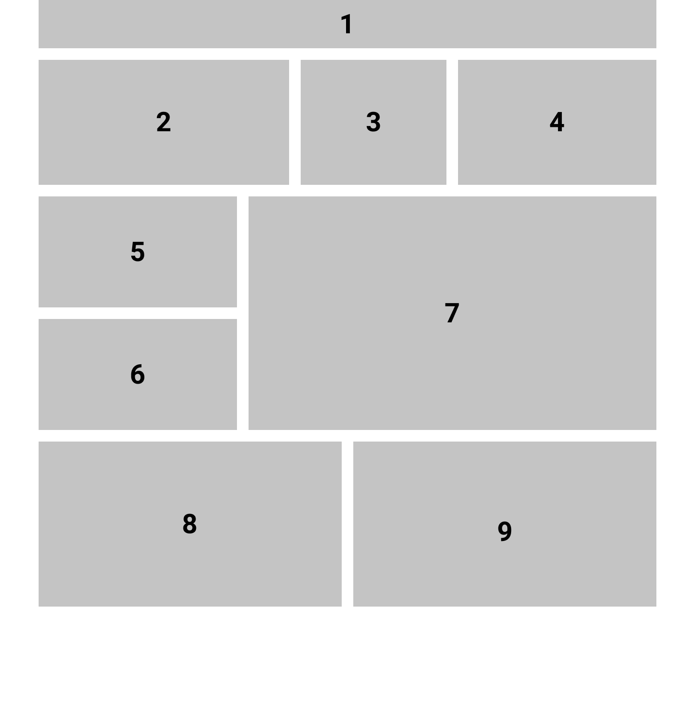
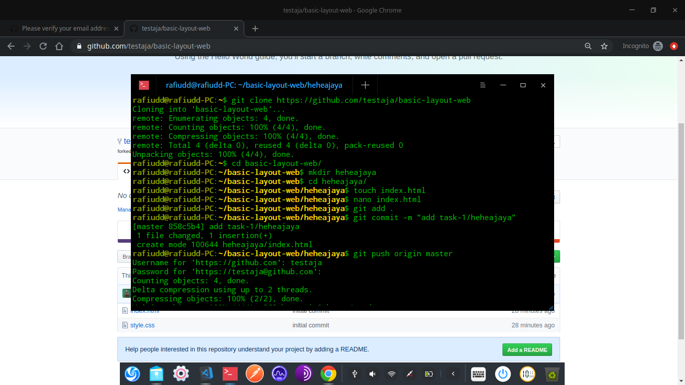
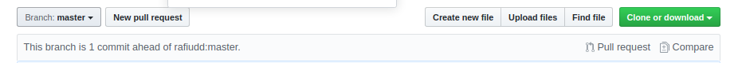
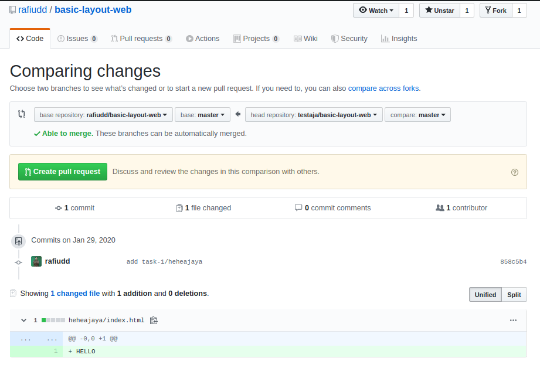
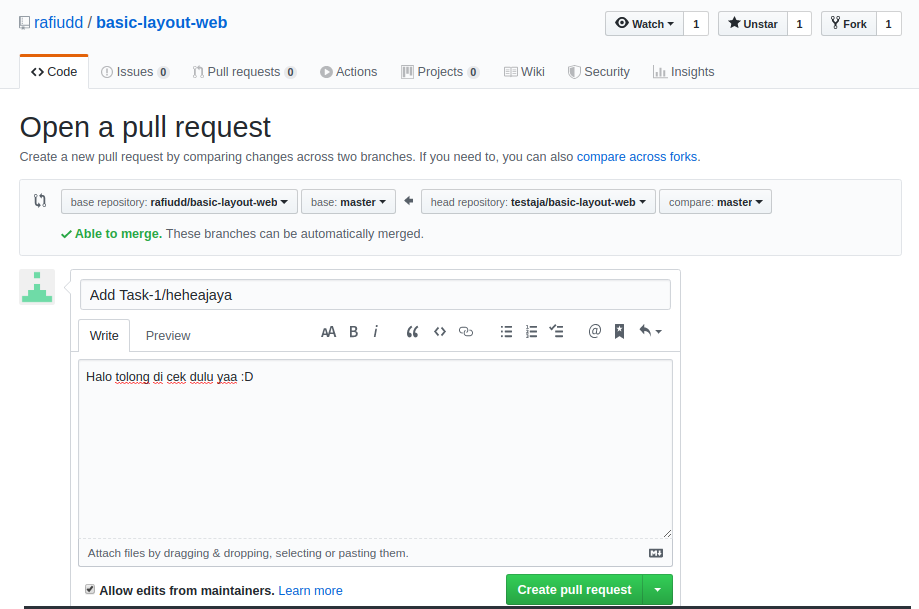
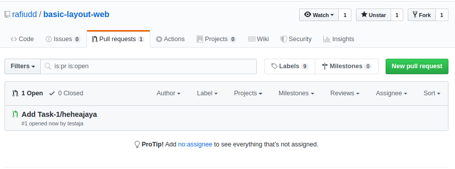
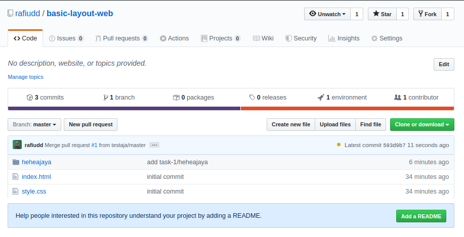

# SCC Task 1

## Create basic layout website like this



Figma Link : https://www.figma.com/file/ks3DjmwxTJEpi0jzBvZrEp/Untitled?node-id=1%3A2

## How to complete
- Follow me and Star this repository to make me happy :D
- Fork this repository
- Then clone your forking repository
``` 
git clone https://github.com/{{github-username}}/basic-layout-web
 ```
- Create folder `yourname or nickname` and copy your task into it
- Make commit to push your changes
```
git add .
git commit -m "your-changes"
```
- Then push to your repository
```
git push origin master
```




- Create Pull Request



- Check your changes



- Describe Your Pull Request on comment, and Pull Request Title `Add Task-1/{{github-username}}`



- Yeayy Done, You're Successfull Completed this task



